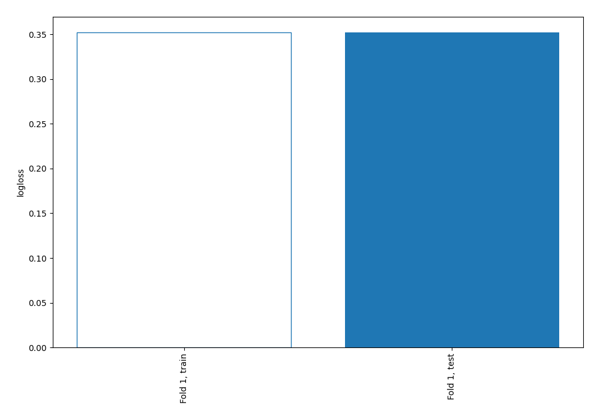
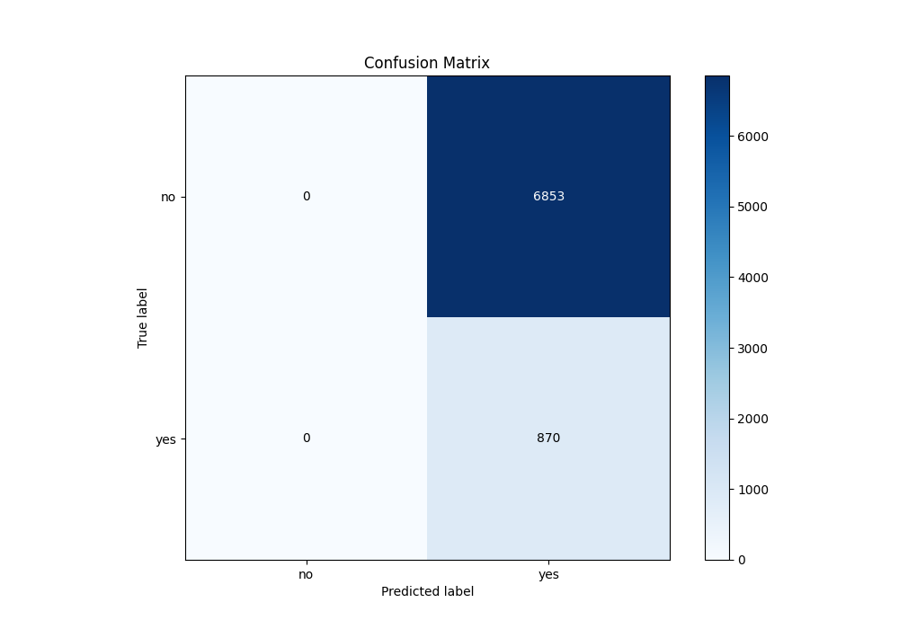
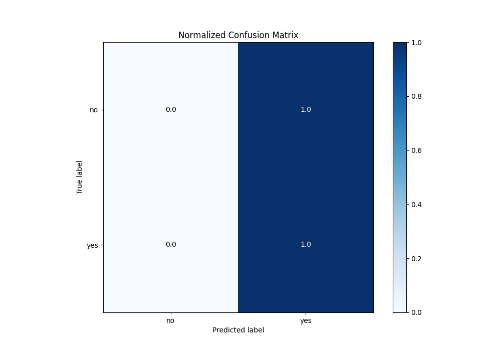
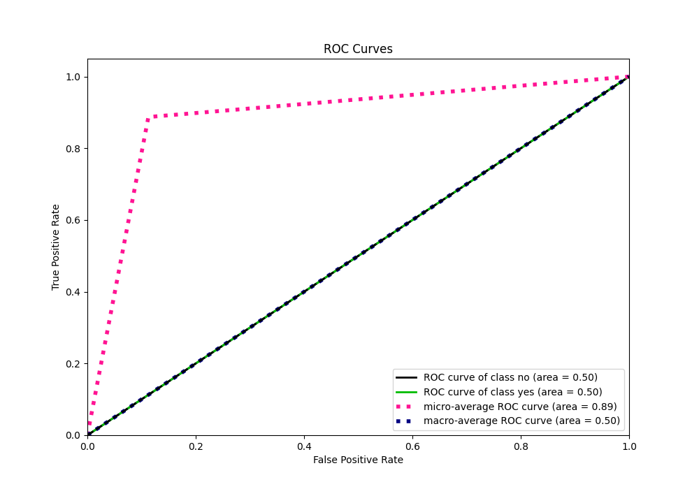
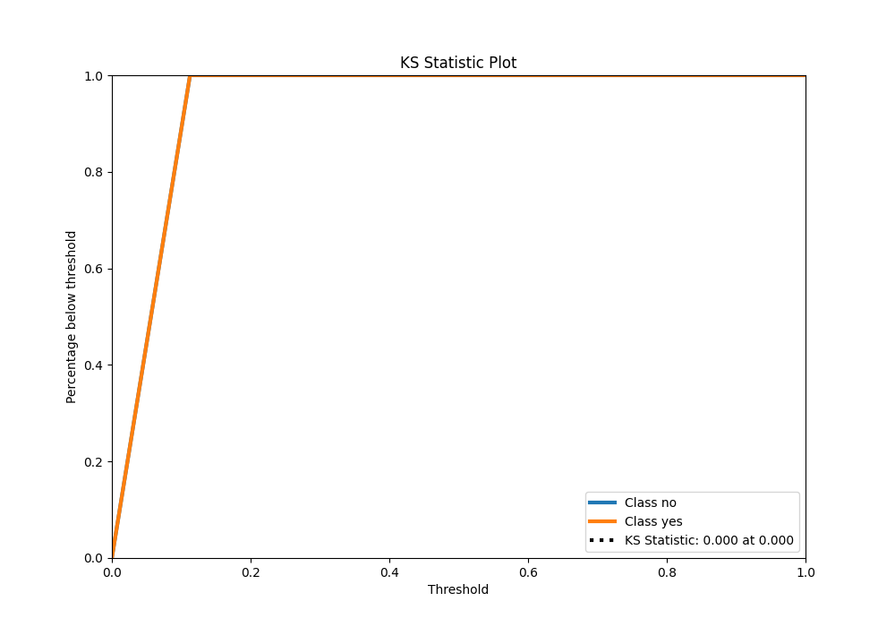
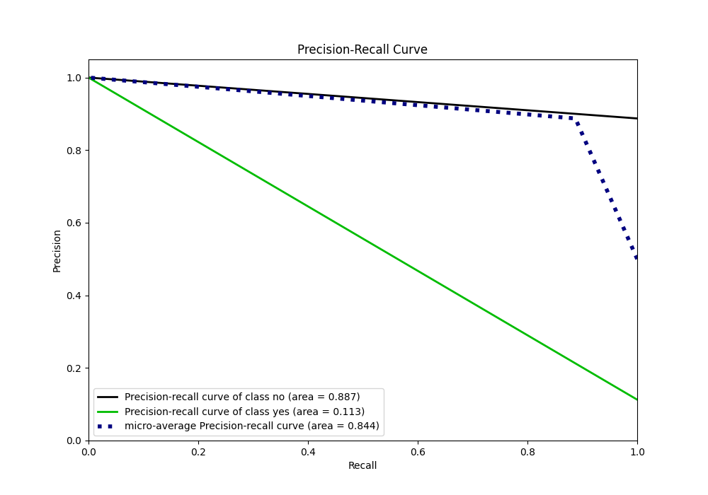

# Summary of 1_Baseline

[<< Go back](../README.md)

## Baseline Classifier (Baseline)
- **n_jobs**: -1
- **explain_level**: 2

## Validation
 - **validation_type**: split
 - **train_ratio**: 0.75
 - **shuffle**: True
 - **stratify**: True

## Optimized metric
logloss

## Training time

1.7 seconds

## Metric details
|           |    score |   threshold |
|:----------|---------:|------------:|
| logloss   | 0.352021 |   nan       |
| auc       | 0.5      |   nan       |
| f1        | 0.20249  |     0.10139 |
| accuracy  | 0.112651 |     0.10139 |
| precision | 0.112651 |     0.10139 |
| recall    | 1        |     0.10139 |
| mcc       | 0        |     0.10139 |

## Metric details with threshold from accuracy metric
|           |    score |   threshold |
|:----------|---------:|------------:|
| logloss   | 0.352021 |   nan       |
| auc       | 0.5      |   nan       |
| f1        | 0.20249  |     0.10139 |
| accuracy  | 0.112651 |     0.10139 |
| precision | 0.112651 |     0.10139 |
| recall    | 1        |     0.10139 |
| mcc       | 0        |     0.10139 |

## Confusion matrix (at threshold=0.10139)
|                |   Predicted as no |   Predicted as yes |
|:---------------|------------------:|-------------------:|
| Labeled as no  |                 0 |               6853 |
| Labeled as yes |                 0 |                870 |

## Learning curves

## Confusion Matrix

## Normalized Confusion Matrix

## ROC Curve

## Kolmogorov-Smirnov Statistic

## Precision-Recall Curve

[<< Go back](../README.md)
