# Summary of 2_DecisionTree

[<< Go back](../README.md)

## Decision Tree
- **n_jobs**: -1
- **criterion**: gini
- **max_depth**: 3
- **explain_level**: 2

## Validation
 - **validation_type**: split
 - **train_ratio**: 0.75
 - **shuffle**: True
 - **stratify**: True

## Optimized metric
logloss

## Training time

41.0 seconds

## Metric details
|           |    score |   threshold |
|:----------|---------:|------------:|
| logloss   | 0.220858 |  nan        |
| auc       | 0.886197 |  nan        |
| f1        | 0.578797 |    0.451358 |
| accuracy  | 0.907031 |    0.49107  |
| precision | 0.592233 |    0.49107  |
| recall    | 1        |    0.011272 |
| mcc       | 0.525154 |    0.451358 |

## Metric details with threshold from accuracy metric
|           |    score |   threshold |
|:----------|---------:|------------:|
| logloss   | 0.220858 |   nan       |
| auc       | 0.886197 |   nan       |
| f1        | 0.576151 |     0.49107 |
| accuracy  | 0.907031 |     0.49107 |
| precision | 0.592233 |     0.49107 |
| recall    | 0.56092  |     0.49107 |
| mcc       | 0.524228 |     0.49107 |

## Confusion matrix (at threshold=0.49107)
|                |   Predicted as no |   Predicted as yes |
|:---------------|------------------:|-------------------:|
| Labeled as no  |              6517 |                336 |
| Labeled as yes |               382 |                488 |

## Learning curves
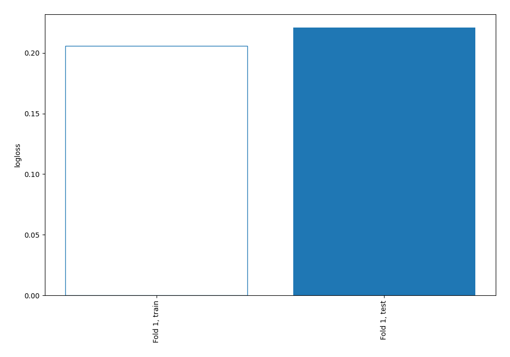

## Permutation-based Importance
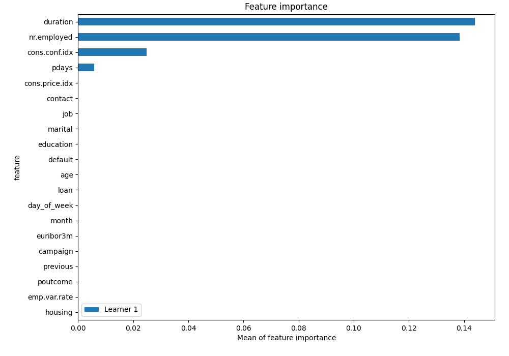
## Confusion Matrix

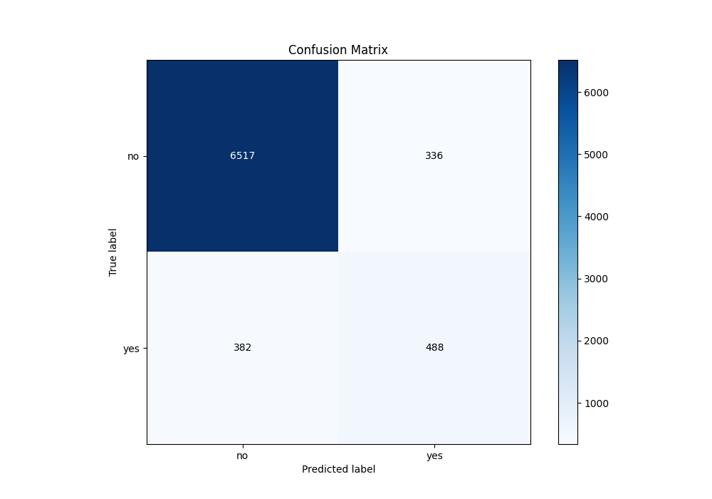

## Normalized Confusion Matrix

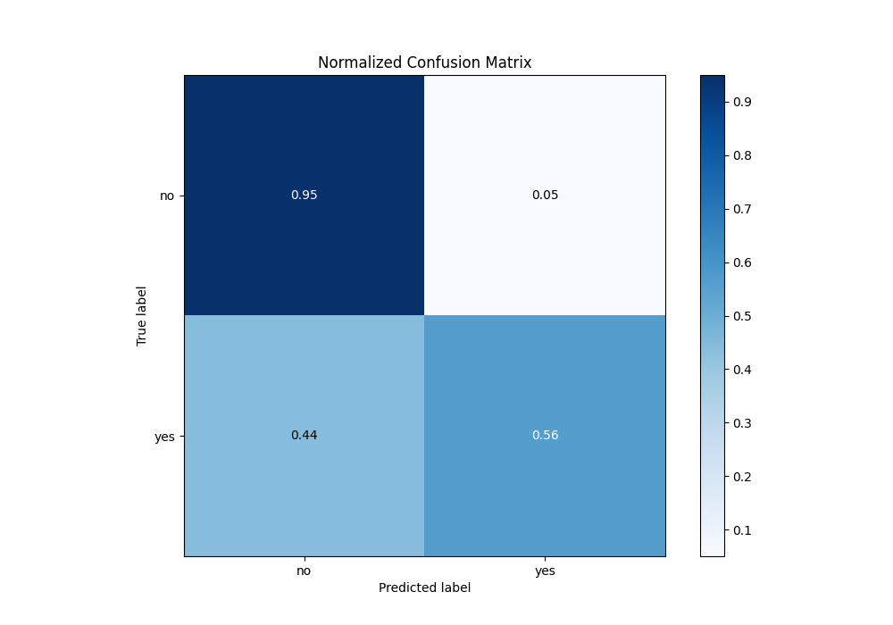

## ROC Curve

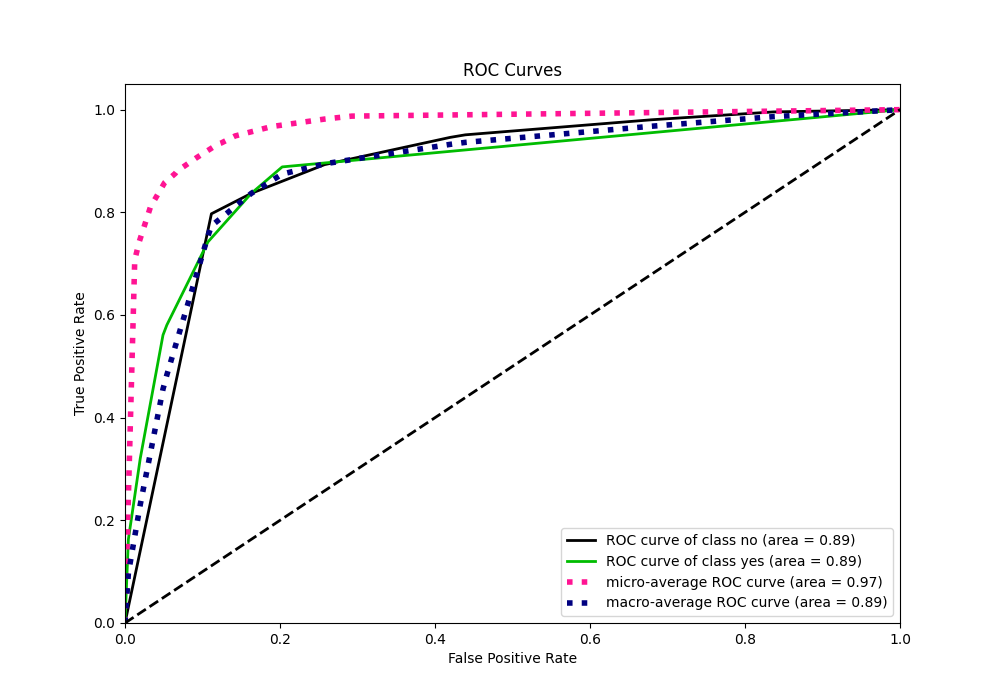

## Kolmogorov-Smirnov Statistic

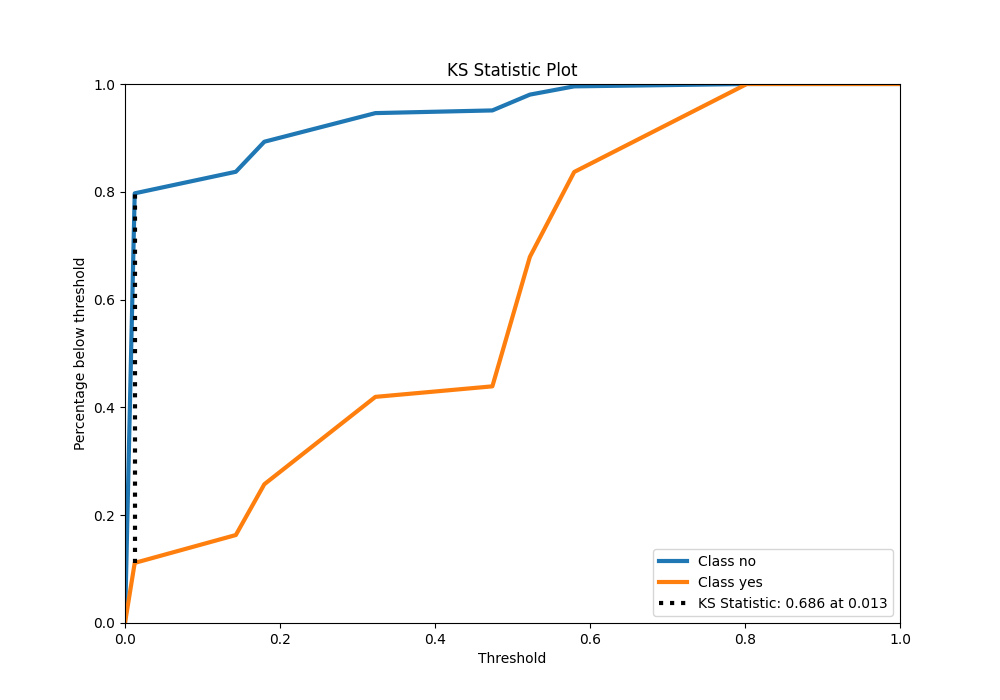

## Precision-Recall Curve

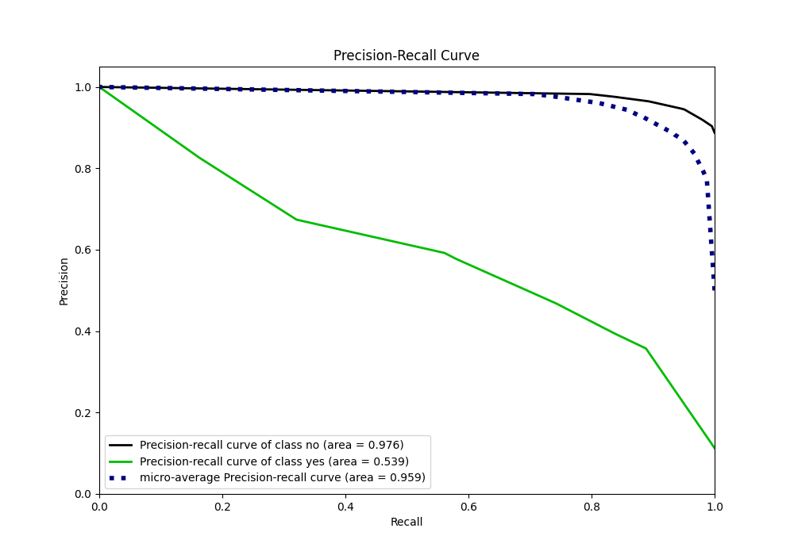

## SHAP Importance
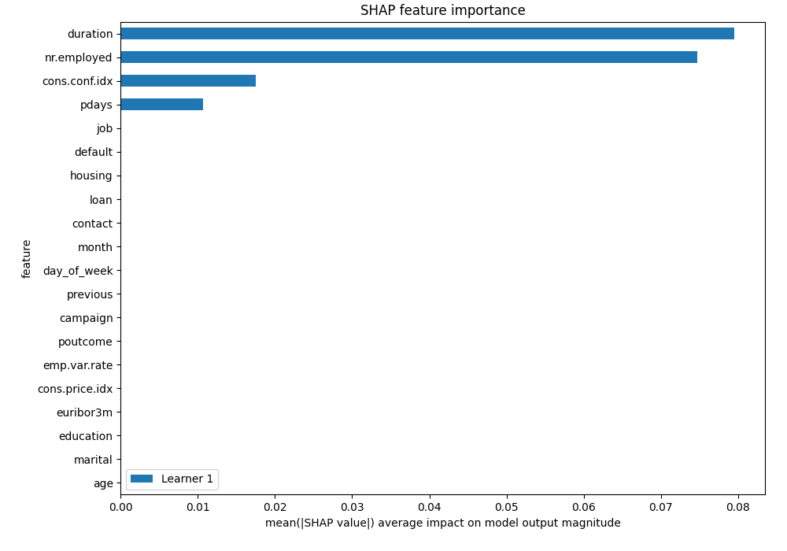

## SHAP Dependence plots

### Dependence (Fold 1)
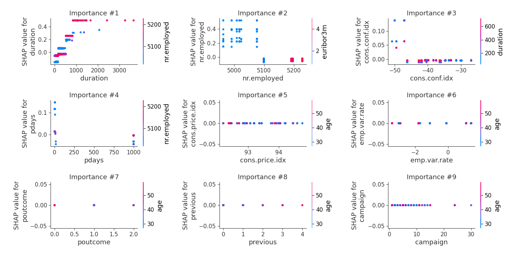

## SHAP Decision plots

### Top-10 Worst decisions for class 0 (Fold 1)
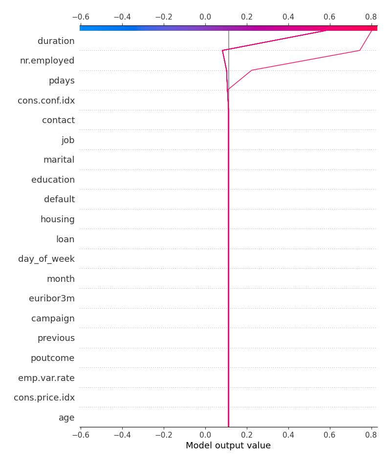
### Top-10 Best decisions for class 0 (Fold 1)

### Top-10 Worst decisions for class 1 (Fold 1)
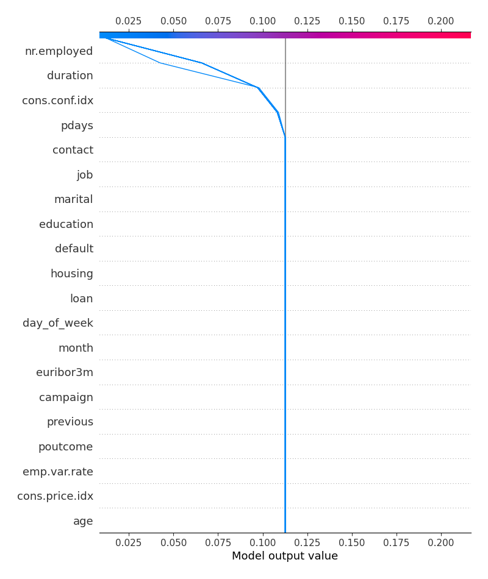
### Top-10 Best decisions for class 1 (Fold 1)
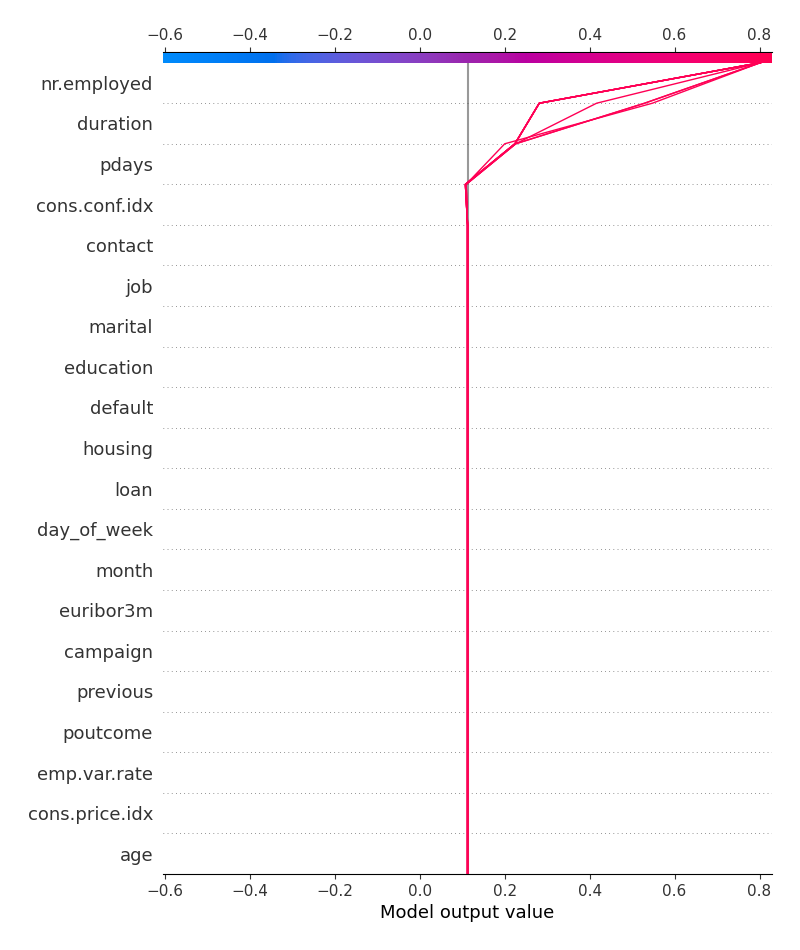

[<< Go back](../README.md)
