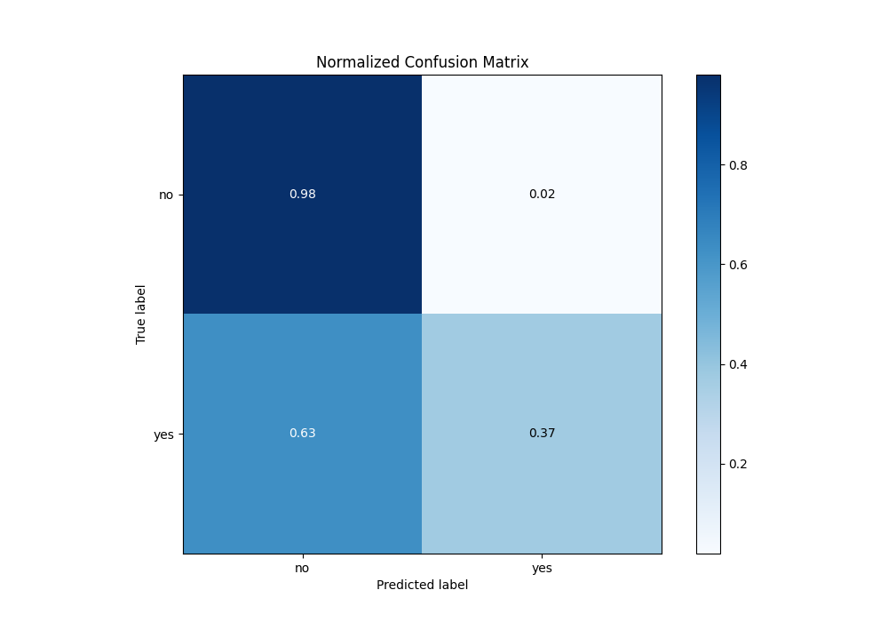

# Summary of 4_Default_NeuralNetwork

[<< Go back](../README.md)

## Neural Network
- **n_jobs**: -1
- **dense_1_size**: 32
- **dense_2_size**: 16
- **learning_rate**: 0.05
- **explain_level**: 2

## Validation
 - **validation_type**: split
 - **train_ratio**: 0.75
 - **shuffle**: True
 - **stratify**: True

## Optimized metric
logloss

## Training time

19.7 seconds

## Metric details
|           |    score |     threshold |
|:----------|---------:|--------------:|
| logloss   | 0.203019 | nan           |
| auc       | 0.935024 | nan           |
| f1        | 0.613613 |   0.360931    |
| accuracy  | 0.908585 |   0.516128    |
| precision | 0.692308 |   0.556366    |
| recall    | 1        |   9.68502e-21 |
| mcc       | 0.568529 |   0.218837    |

## Metric details with threshold from accuracy metric
|           |    score |   threshold |
|:----------|---------:|------------:|
| logloss   | 0.203019 |  nan        |
| auc       | 0.935024 |  nan        |
| f1        | 0.474702 |    0.516128 |
| accuracy  | 0.908585 |    0.516128 |
| precision | 0.672996 |    0.516128 |
| recall    | 0.366667 |    0.516128 |
| mcc       | 0.453202 |    0.516128 |

## Confusion matrix (at threshold=0.516128)
|                |   Predicted as no |   Predicted as yes |
|:---------------|------------------:|-------------------:|
| Labeled as no  |              6698 |                155 |
| Labeled as yes |               551 |                319 |

## Learning curves

## Permutation-based Importance

## Confusion Matrix

## Normalized Confusion Matrix

## ROC Curve

## Kolmogorov-Smirnov Statistic

## Precision-Recall Curve

[<< Go back](../README.md)
