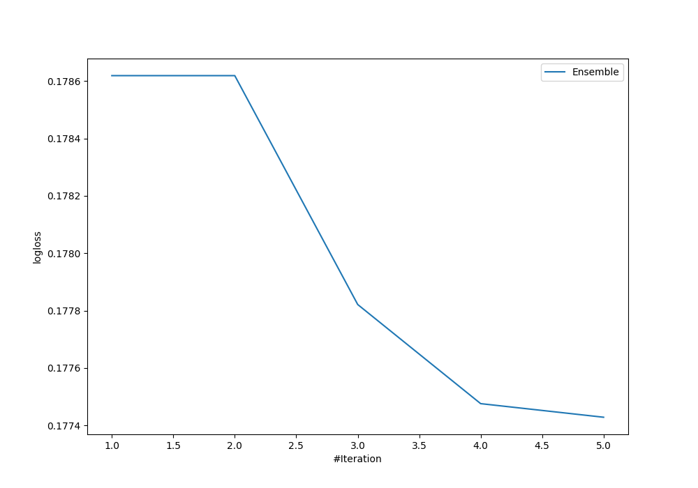
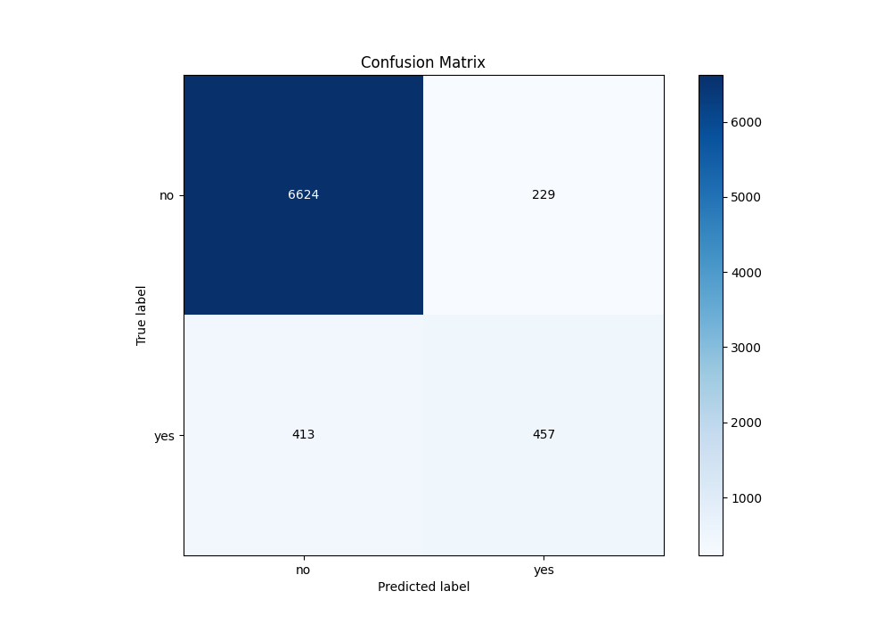
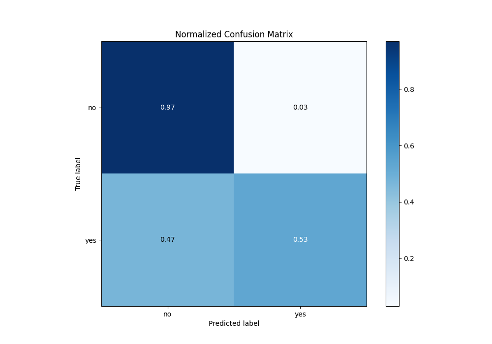
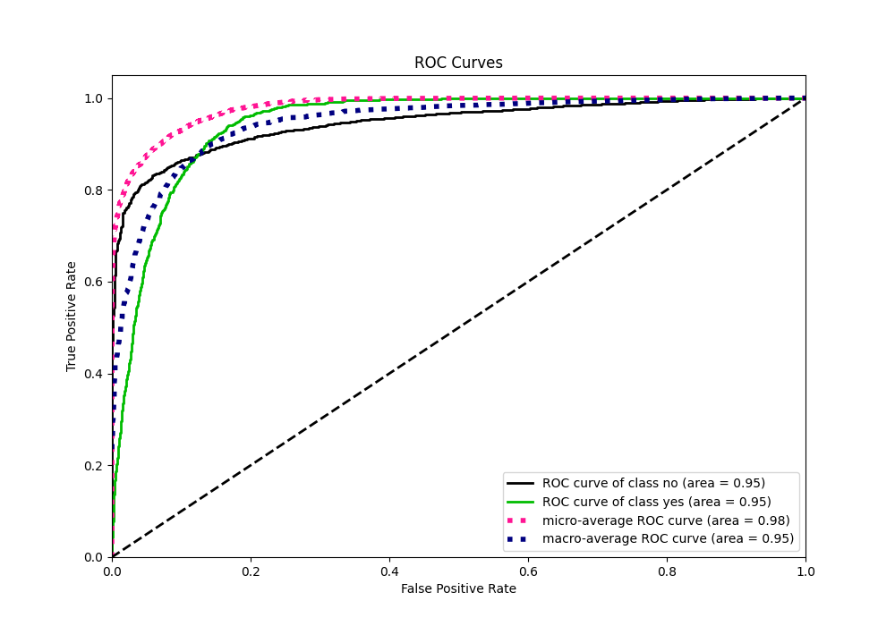
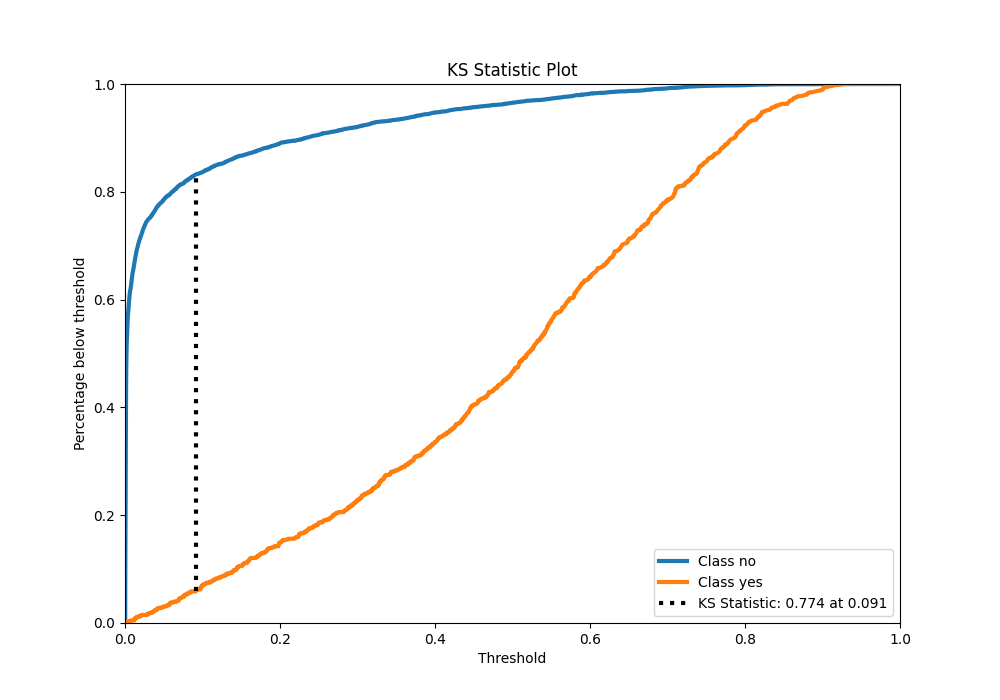

# Summary of Ensemble

[<< Go back](../README.md)

## Ensemble structure
| Model                   |   Weight |
|:------------------------|---------:|
| 3_Default_Xgboost       |        4 |
| 4_Default_NeuralNetwork |        1 |

## Metric details
|           |    score |     threshold |
|:----------|---------:|--------------:|
| logloss   | 0.177428 | nan           |
| auc       | 0.94601  | nan           |
| f1        | 0.646399 |   0.281485    |
| accuracy  | 0.916872 |   0.506236    |
| precision | 0.670788 |   0.520433    |
| recall    | 1        |   0.000236811 |
| mcc       | 0.606017 |   0.281485    |

## Metric details with threshold from accuracy metric
|           |    score |   threshold |
|:----------|---------:|------------:|
| logloss   | 0.177428 |  nan        |
| auc       | 0.94601  |  nan        |
| f1        | 0.587404 |    0.506236 |
| accuracy  | 0.916872 |    0.506236 |
| precision | 0.666181 |    0.506236 |
| recall    | 0.525287 |    0.506236 |
| mcc       | 0.546633 |    0.506236 |

## Confusion matrix (at threshold=0.506236)
|                |   Predicted as no |   Predicted as yes |
|:---------------|------------------:|-------------------:|
| Labeled as no  |              6624 |                229 |
| Labeled as yes |               413 |                457 |

## Learning curves

## Confusion Matrix

## Normalized Confusion Matrix

## ROC Curve

## Kolmogorov-Smirnov Statistic

## Precision-Recall Curve

[<< Go back](../README.md)
