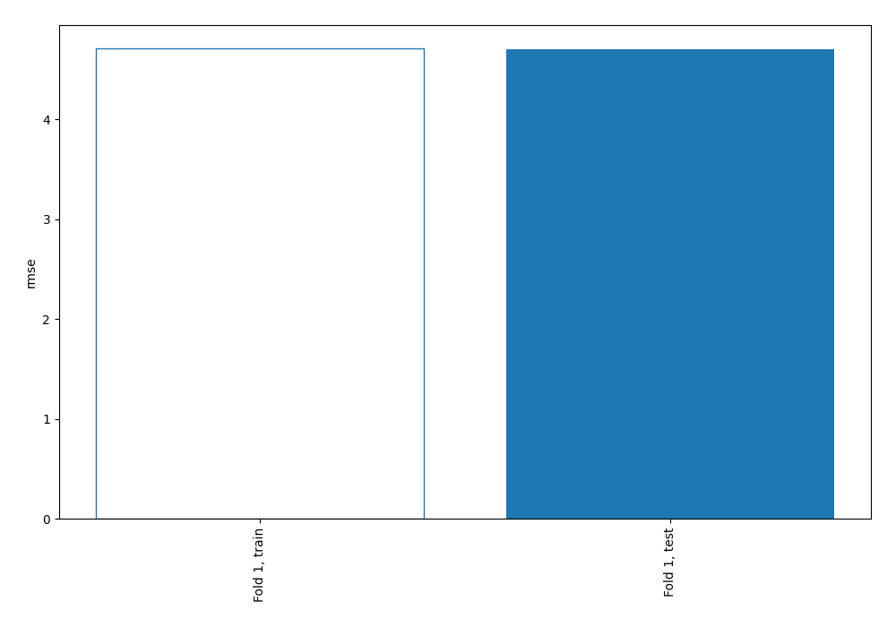
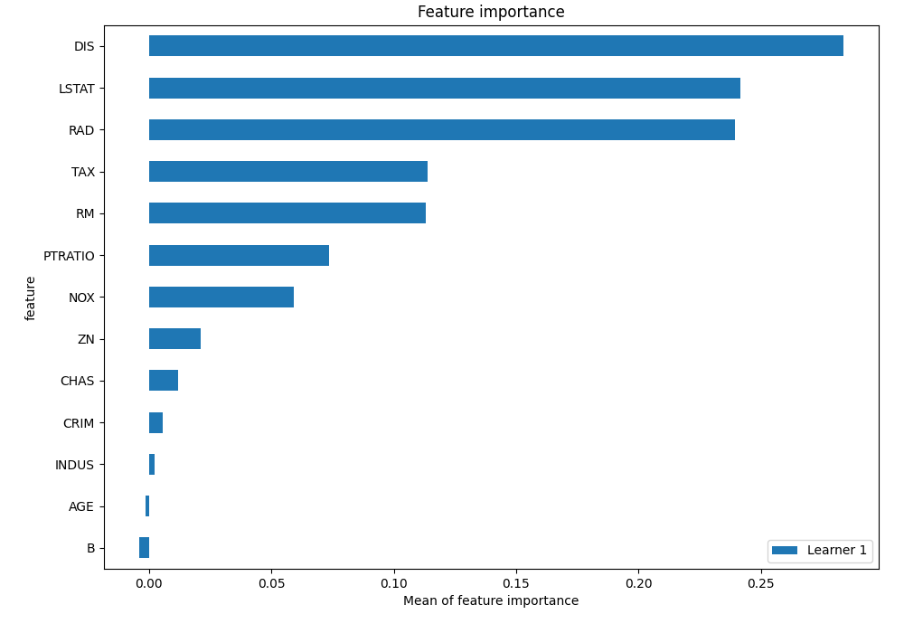
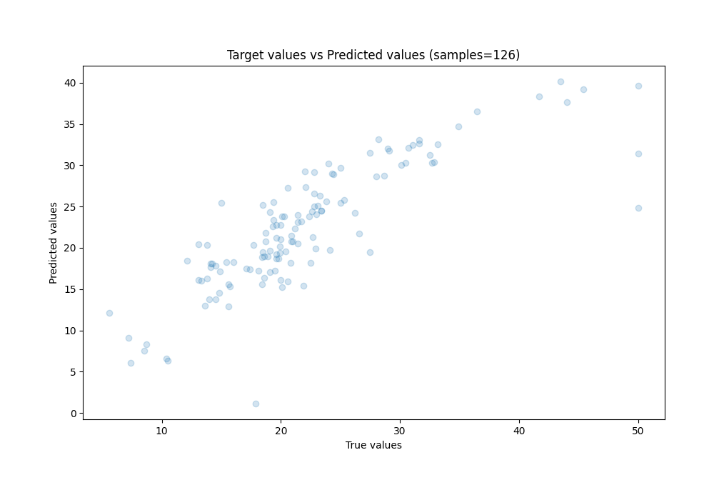
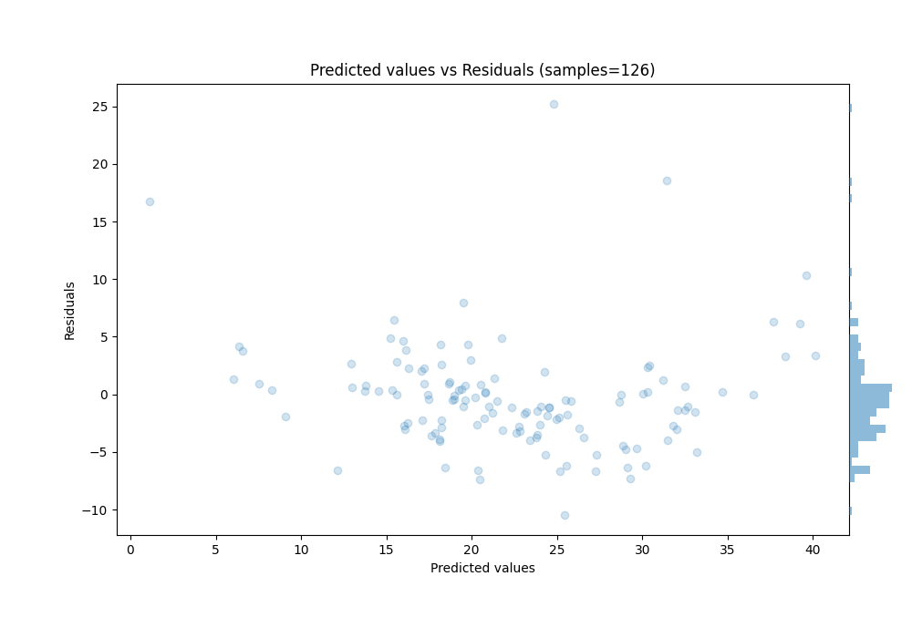
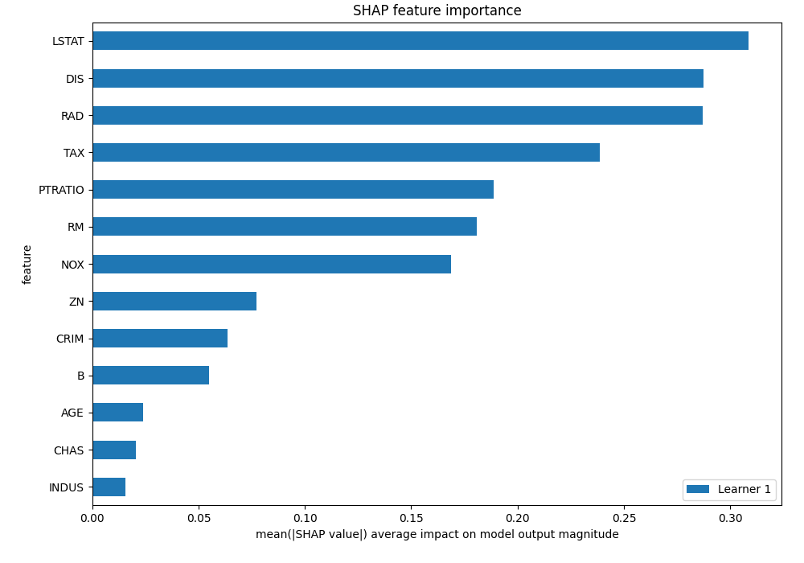
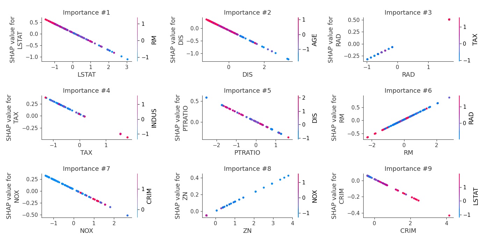
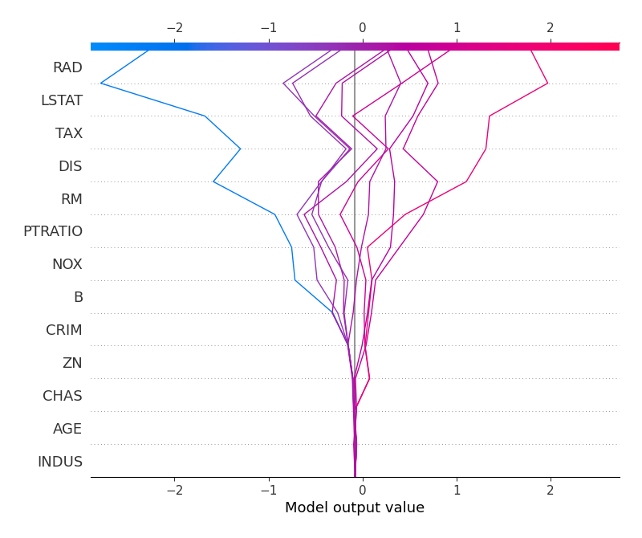
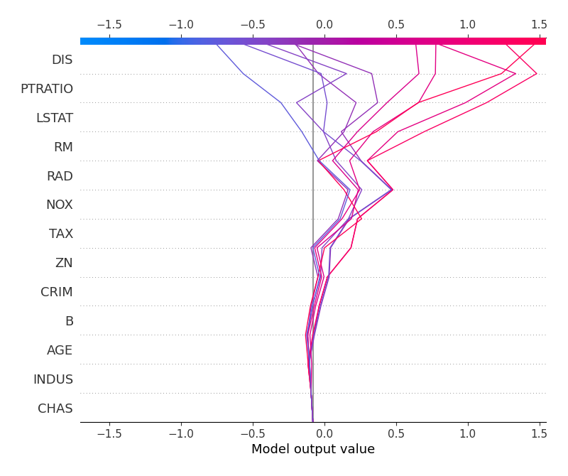

# Summary of 3_Linear

[<< Go back](../README.md)

## Linear Regression (Linear)
- **n_jobs**: -1
- **explain_level**: 2

## Validation
 - **validation_type**: split
 - **train_ratio**: 0.75
 - **shuffle**: True

## Optimized metric
rmse

## Training time

7.3 seconds

### Metric details:
| Metric   |     Score |
|:---------|----------:|
| MAE      |  3.12708  |
| MSE      | 22.0988   |
| RMSE     |  4.70093  |
| R2       |  0.685169 |
| MAPE     |  0.155219 |

## Learning curves

## Coefficients
| feature   |   Learner_1 |
|:----------|------------:|
| RAD       |   0.311601  |
| RM        |   0.302121  |
| CHAS      |   0.17426   |
| B         |   0.116811  |
| ZN        |   0.110596  |
| INDUS     |   0.0167694 |
| intercept |  -0.0129081 |
| AGE       |  -0.0271939 |
| CRIM      |  -0.107225  |
| NOX       |  -0.20729   |
| PTRATIO   |  -0.227906  |
| TAX       |  -0.266835  |
| DIS       |  -0.344102  |
| LSTAT     |  -0.380662  |

## Permutation-based Importance

## True vs Predicted

## Predicted vs Residuals

## SHAP Importance

## SHAP Dependence plots

### Dependence (Fold 1)

## SHAP Decision plots

### Top-10 Worst decisions (Fold 1)

### Top-10 Best decisions (Fold 1)

[<< Go back](../README.md)
