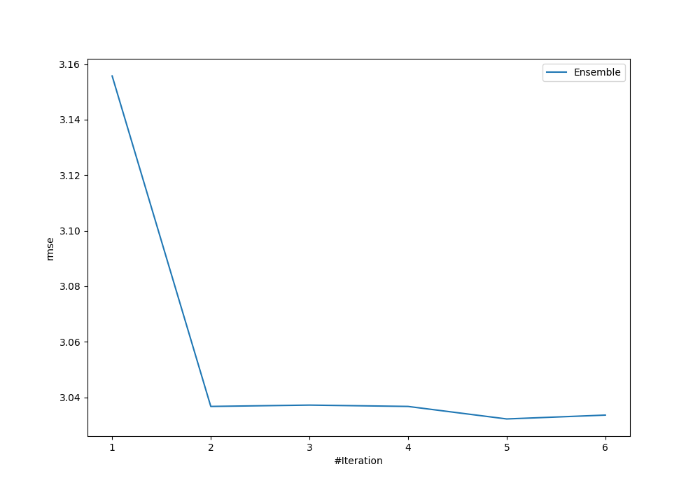
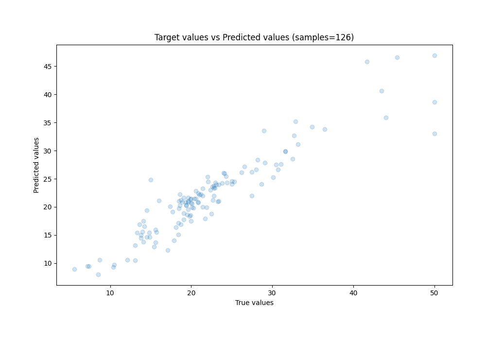
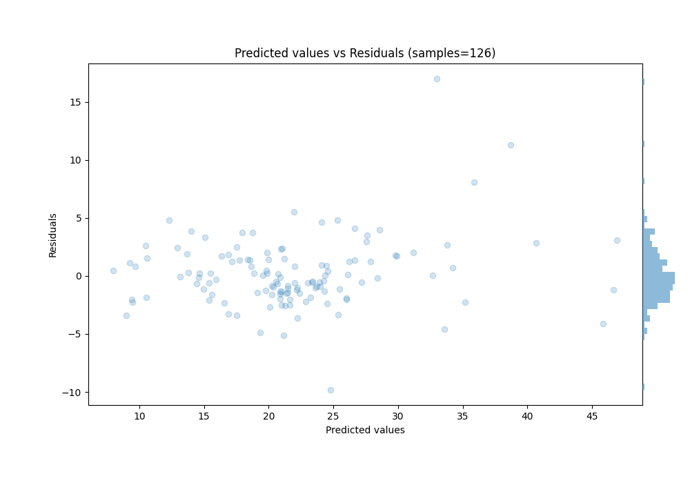

# Summary of Ensemble

[<< Go back](../README.md)

## Ensemble structure
| Model                  |   Weight |
|:-----------------------|---------:|
| 4_Default_Xgboost      |        3 |
| 6_Default_RandomForest |        2 |

### Metric details:
| Metric   |    Score |
|:---------|---------:|
| MAE      | 2.06488  |
| MSE      | 9.19436  |
| RMSE     | 3.03222  |
| R2       | 0.869012 |
| MAPE     | 0.100251 |

## Learning curves

## True vs Predicted

## Predicted vs Residuals

[<< Go back](../README.md)
